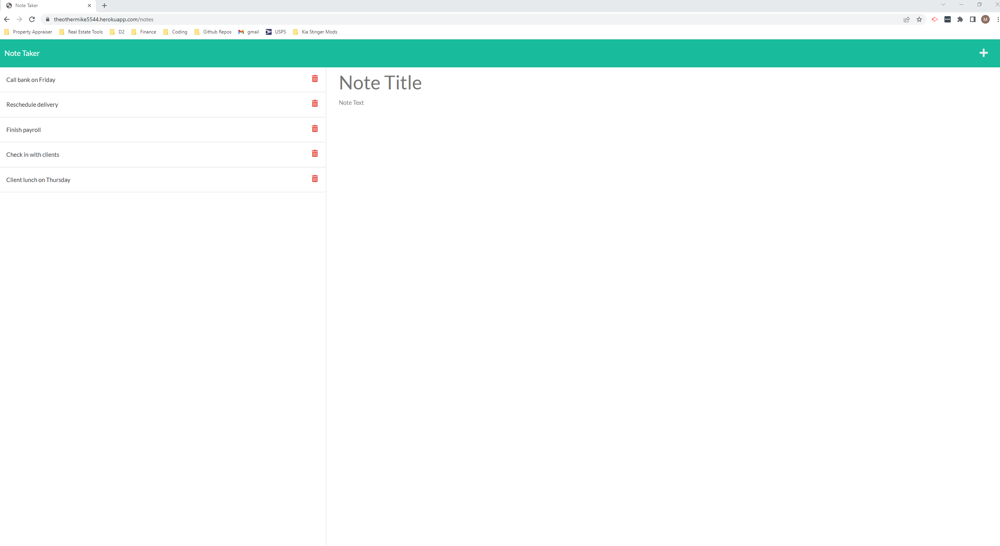

# Note-Taker

## Description

  
* This application uses a back end built upon Express.js which saves and retrieves data from a JSON file based on the user's input. The user than can choose to save a note if they would like. The application will delete from the json file and therefor the page. At this point the user can then opt to create a new note.

* Access Application Functionality Here: (https://theothermike5544.herokuapp.com/notes)

## User Story

```
AS A small business owner
I WANT to be able to write and save notes
SO THAT I can organize my thoughts and keep track of tasks I need to complete
```

## Table of Contents
  * [Usage](#usage)
  * [Links](#links)
  * [Contributions](#contributions)
  * [Questions](#questions)

## Usage

 

## Links
 
  * Heroku Deployed demo link: (https://theothermike5544.herokuapp.com/)
  * Github Repository URL: (https://github.com/Theothermike5544/Note-Taker)


## Contributions

  Fork, request, or contact me at below.
  

## Questions

  [](https://github.com/Theothermike5544) 
  [](https://www.linkedin.com/in/michael-bishop-1b3358104/)
  Feel free to reach me at mrbishop5544@gmail.com with any question regarding this project!
  